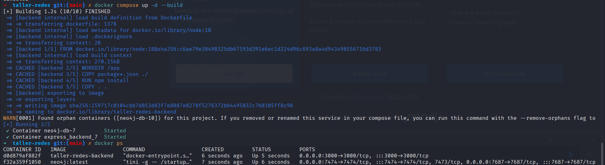
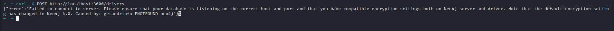
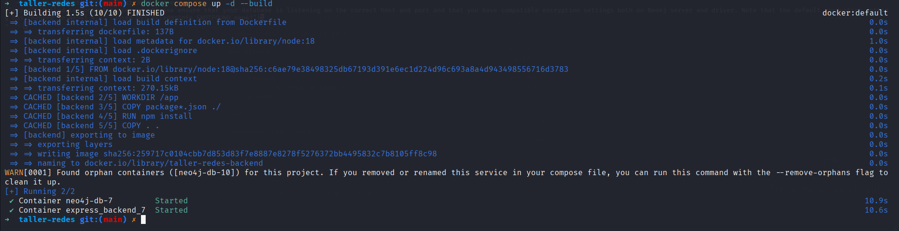
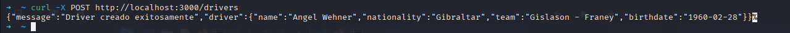

# TALLER REDES DOCKER-COMPOSE BRIDGE DEFECTO Y USER-DEFINEND

## 1.Cree un docker-compose.yml con dos servicios

Creamos nuestro [docker-compose.yml](docker-compose.yml) en donde dclaramos nuestros dos servicios, el API en node.js que se encuentra en [backend/app.js](backend/app.js) nuestro docker-compose 1 es de la siguiente manera:

```yaml
volumes:
  neo4j_datas:

services:
  neo4j:
    image: neo4j:latest
    container_name: neo4j-db-7
    restart: always
    environment:
      - NEO4J_AUTH=${NEO4J_USERNAME}/${NEO4J_PASSWORD}
    ports:
      - "7474:7474"
      - "7687:7687"
    volumes:
      - neo4j_datas:/data
      - ./import:/var/lib/neo4j/import
    network_mode: bridge

  backend:
    build: ./backend
    container_name: express_backend_7
    restart: always
    env_file:
      - .env
    ports:
      - "${EXPRESS_PORT}:3000"
    depends_on:
      - neo4j
    network_mode: bridge
```

levantamos nuestros servicios



e intentamos hacer una peticion a la base de datos desde nuestro servidor

```bash
curl -X POST http://localhost:3000/drivers
```

evidenciando que no se puede conectar



## 2.Docker compose con red definida

```yaml
volumes:
  neo4j_datas:

networks:
  app_network:
    driver: bridge

services:
  neo4j:
    image: neo4j:latest
    container_name: neo4j-db-7
    restart: always
    environment:
      - NEO4J_AUTH=${NEO4J_USERNAME}/${NEO4J_PASSWORD}
    ports:
      - "7474:7474"
      - "7687:7687"
    volumes:
      - neo4j_datas:/data
      - ./import:/var/lib/neo4j/import
    networks:
      - app_network

  backend:
    build: ./backend
    container_name: express_backend_7
    restart: always
    env_file:
      - .env
    ports:
      - "${EXPRESS_PORT}:3000"
    depends_on:
      - neo4j
    networks:
      - app_network
```



intentamos hacer una peticion a la base de datos desde nuestra API


